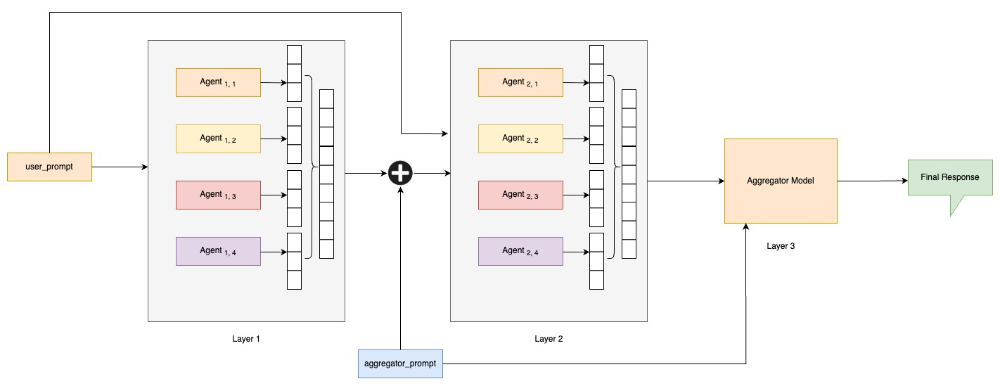

# Mixture-of-Agents



This is a practical implementation of the paper titled *"Mixture-of-Agents Enhances Large Language Model Capabilities"*.  
[Read the paper](https://arxiv.org/abs/2406.04692)

---

## Overview

This project implements a multi-layer Mixture-of-Agents (MoA) framework that enhances LLM performance through collective reasoning. Each layer builds upon the outputs of the previous one, leading to a final refined answer.

---

## Architecture

- **Layer 1:** Initial brainstorming by reference models.
- **Layer 2+:** Refined reasoning by the same models on the user's prompt using prior layer's outputs.
- **Final Layer:** Aggregator model synthesizes all responses into a single, coherent, and higher-quality response.

---

## Directory Structure

```
root/
├── alpaca-eval/             # Contains evaluation-specific files
│   ├── prompts.jsonl        # Input prompts
│   ├── moa_preds.jsonl      # Outputs from MoA system
│   ├── base_preds.jsonl     # Outputs from base model
│   └── results.json         # Judging results
├── moa-advanced.py          # Main runner script for multi-agent inference
├── moa.py                   # Simplified single layer model for MoA
├── requirements.txt         # Dependencies
├── .env                     # Stores API Keys
├── assets/
│   └── workflow.jpg         # Architecture image
```

---

## Running the MoA Pipeline

```bash
python moa-advanced.py
```

This will:
- Read prompts given by user
- Generate outputs via MoA

---

## Evaluating with AlpacaEval

```bash
alpaca_eval evaluate \
  --model_outputs1 alpaca-eval/moa_preds.jsonl \
  --model_outputs2 alpaca-eval/base_preds.jsonl \
  --input_prompts alpaca-eval/prompts.jsonl \
  --judge together/deepseek-ai/DeepSeek-V3 \
  --output_path alpaca-eval/results.json \
  --no_leaderboard
```

---

## Models Used

- **Reference Models:**
  - `meta-llama/Llama-3.3-70B-Instruct-Turbo`
  - `Qwen/Qwen2.5-72B-Instruct-Turbo`
  - `Qwen/Qwen2.5-Coder-32B-Instruct`
  - `deepseek-ai/DeepSeek-V3`

- **Aggregator Model:**
  - `deepseek-ai/DeepSeek-V3`

---
